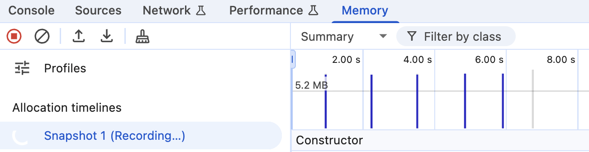
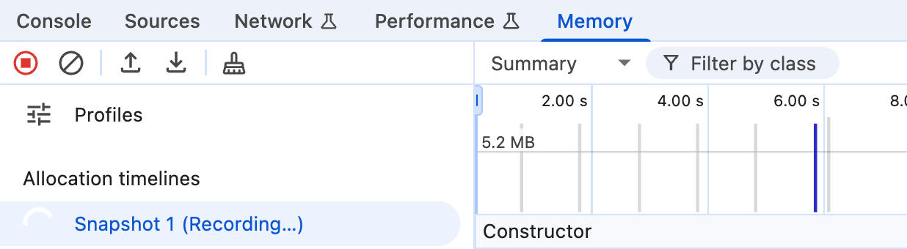

# Demo of memory leaks after terser minifying

Credit to [this blog post](https://blog.meteor.com/an-interesting-kind-of-javascript-memory-leak-8b47d2e7f156).

Input is not leaking, `--compress module=true,inline=false` is combination of safe options, but result in memory leaks.

## `before.js` does not leak.

To verify it, run the following command:

```
$ node --inspect before.js
```

Open `chrome://inspect` and record a memory timeline.

## After minifying, the `after.js` leaks.

```
$ npm build
$ node --inspect after.js
```

Open `chrome://inspect` and record a memory timeline.



## With `reduce_vars=false` the `after.js` does not leak.


```
$ npm build:fixed
$ node --inspect after.js
```

Open `chrome://inspect` and record a memory timeline.

