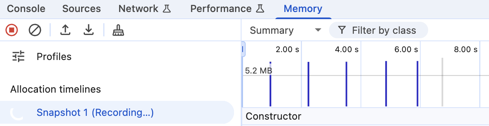

# Demo of memory leaks after terser minifying

## Before fix, the `leaks.js` leaks

The `leaks.js` leaks memory every 1 second. (Credit to [this blog post](https://blog.meteor.com/an-interesting-kind-of-javascript-memory-leak-8b47d2e7f156))

To verify it, run the following command:

```
$ node --inspect leaks.js
```

Open `chrome://inspect` and record a memory timeline.



## After fix, the `fix.js` doesn't leak

Look at `fix.js` to see how it is fixed by extracting the inner function declaration into module scope.

You can verify it by memory timeline again.

## But `fix.js` leaks again after terser minifying

Minify `fix.js` by terser with "--compress module=true" option:
```bash
$ npm run build:terser
```

Look at `terser-output.js` to see how terser moves the `fix` function from module scope to inner of the `replaceThing` function. Which reverts the fix.

I found that if you run terser with `--compress module=true,reduce_funcs=false` option, it doesn't leak.

```bash
$ npm run build:terser:fixed
```

It seem both `module` and `reduce_funcs` options are not labeled as "unsafe", but together they could break the code.